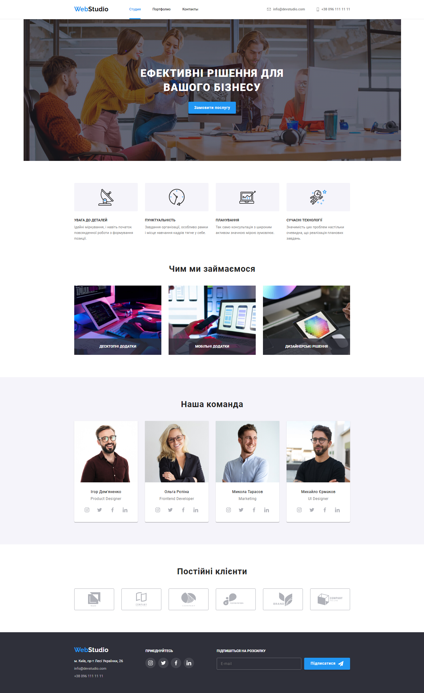

# HTML + CSS BOOTCAMP

🗓 **`01/09/2022 - 16/10/2022`**

## Homework is organized into branches

`HTML+CSS : 14 classes, 28 hours, 7 assignments on Tech Skills`

 

| **№**         | **HTML+CSS units:**                                                    |
|---------------|------------------------------------------------------------------------|
| _**Unit 1.**_ | _HTML Basics.Tags and Attributes. Semantics_                           |
| _**Unit 2.**_ | _CSS Basics Selectors Color. Text Decoration and Fonts_                |
| _**Unit 3.**_ | _Block Model. Flexbox_                                                 |
| _**Unit 4.**_ | _Background and Decorative Elements_                                   |
| _**Unit 5.**_ | _Positioning of Elements. Transformations. Transitions and Animations_ |
| _**Unit 6.**_ | _Forms_                                                                |
| _**Unit 7.**_ | _Media Rules. Responsive Layout. Responsive Graphics_                  |
 

 
 
 

> *"Simplicity is the key to reliability" - Edsger W. Dijkstra*

